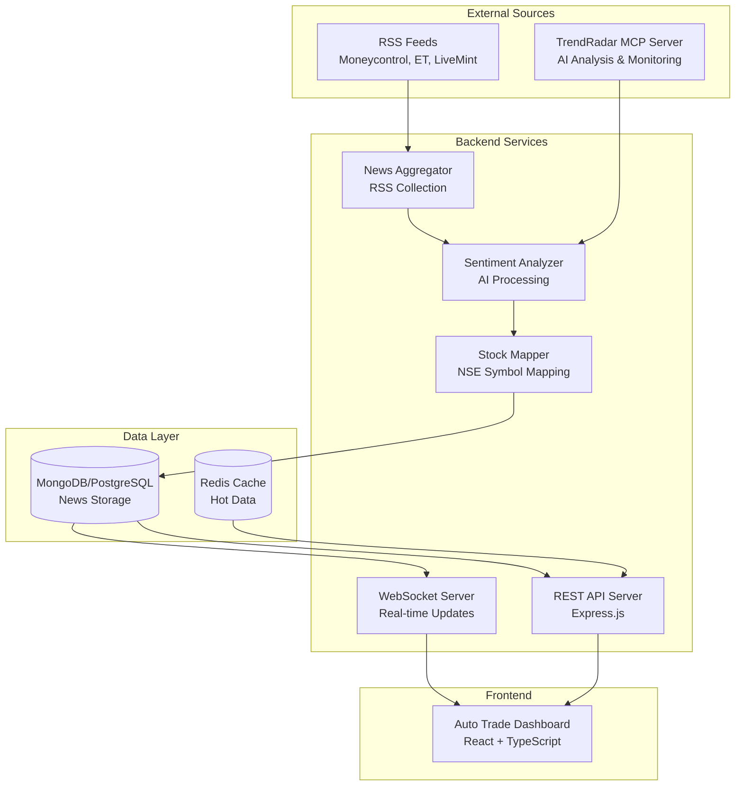

# Design Document

## Overview

The TrendRadar News Integration system is a comprehensive backend solution that bridges the existing Auto Trade React dashboard with real-time Indian financial news data. The system leverages TrendRadar's AI-powered news monitoring capabilities through MCP (Model Context Protocol) integration, providing sentiment analysis, stock symbol mapping, and real-time news delivery to support intraday trading decisions.

The architecture follows a microservices approach with clear separation between news aggregation, processing, and delivery layers. The system replaces mock data with live feeds from trusted Indian financial sources while maintaining the existing frontend interface contract.

## Architecture

### System Components



### Technology Stack

**Backend Framework:**
- .NET 8+ with ASP.NET Core for REST API and WebSocket support
- C# for type safety and robust development experience
- Custom MCP client implementation for TrendRadar integration

**Data Storage:**
- Primary: MongoDB with MongoDB.Driver for document-based news storage
- Alternative: PostgreSQL with Entity Framework Core and JSONB support
- Caching: Redis with StackExchange.Redis for hot data and session management

**Real-time Communication:**
- SignalR for real-time news updates and WebSocket management
- Server-Sent Events (SSE) as fallback for SignalR failures

**External Integrations:**
- TrendRadar MCP Server for AI-powered news analysis
- RSS parsers using SyndicationFeed for Indian financial news sources
- NSE API integration for stock symbol validation

## Components and Interfaces

### News Aggregator Service

**Responsibilities:**
- Monitor RSS feeds from configured Indian financial news sources
- Fetch new articles every 5 minutes using configurable intervals
- Handle feed format variations and parsing errors gracefully
- Deduplicate articles using content hashing algorithms

**Interface:**
```csharp
public interface INewsAggregator
{
    Task StartMonitoringAsync();
    Task StopMonitoringAsync();
    Task<List<RawArticle>> FetchFromSourceAsync(string sourceUrl);
    Task<bool> ValidateFeedAsync(string feedUrl);
}

public class RawArticle
{
    public string Title { get; set; }
    public string Content { get; set; }
    public string Url { get; set; }
    public DateTime PublishedAt { get; set; }
    public string Source { get; set; }
    public string ContentHash { get; set; }
}
```

### TrendRadar MCP Integration

**Responsibilities:**
- Initialize and maintain connection to TrendRadar MCP server
- Utilize TrendRadar's 13 intelligent analysis tools
- Handle MCP protocol communication and error recovery
- Configure TrendRadar for Indian financial news sources

**Interface:**
```csharp
public interface ITrendRadarClient
{
    Task ConnectAsync();
    Task DisconnectAsync();
    Task<AnalysisResult> AnalyzeArticleAsync(RawArticle article);
    Task<TrendData> DetectTrendsAsync(List<RawArticle> articles);
    Task<List<MCPTool>> GetAvailableToolsAsync();
}

public class AnalysisResult
{
    public SentimentScore Sentiment { get; set; }
    public List<string> Keywords { get; set; }
    public List<EntityData> Entities { get; set; }
    public double MarketRelevance { get; set; }
    public MarketCategory Category { get; set; }
}
```

### Sentiment Analyzer Service

**Responsibilities:**
- Process articles through TrendRadar's AI sentiment analysis
- Assign sentiment scores with confidence levels
- Categorize news by market sectors (banking, IT, pharma, etc.)
- Extract market-relevant keywords and named entities

**Interface:**
```csharp
public interface ISentimentAnalyzer
{
    Task<ProcessedArticle> AnalyzeArticleAsync(RawArticle article);
    Task<List<ProcessedArticle>> BatchAnalyzeAsync(List<RawArticle> articles);
    Task<MarketCategory> CategorizeByMarketAsync(ProcessedArticle article);
}

public class SentimentScore
{
    public double Positive { get; set; }    // 0-1 confidence
    public double Negative { get; set; }    // 0-1 confidence  
    public double Neutral { get; set; }     // 0-1 confidence
    public string Overall { get; set; }     // "positive", "negative", "neutral"
    public double Confidence { get; set; }  // 0-1 overall confidence
}

public class ProcessedArticle : RawArticle
{
    public SentimentScore Sentiment { get; set; }
    public List<string> Keywords { get; set; }
    public List<EntityData> Entities { get; set; }
    public MarketCategory MarketCategory { get; set; }
    public double MarketRelevance { get; set; }
    public DateTime ProcessedAt { get; set; }
}
```

### Stock Mapper Service

**Responsibilities:**
- Maintain database of NSE stock symbols with company name variations
- Map news articles to relevant NSE stock symbols using NLP
- Support filtering by specific stocks or market sectors
- Handle company name variations and aliases

**Interface:**
```csharp
public interface IStockMapper
{
    Task<List<string>> MapArticleToStocksAsync(ProcessedArticle article);
    Task UpdateStockDatabaseAsync();
    Task<StockSymbol?> FindStockByNameAsync(string companyName);
    Task<List<StockSymbol>> GetStocksByCategoryAsync(MarketCategory category);
}

public class StockSymbol
{
    public string Symbol { get; set; }        // NSE symbol (e.g., "RELIANCE")
    public string CompanyName { get; set; }   // Official company name
    public List<string> Aliases { get; set; } // Alternative names/variations
    public MarketCategory Sector { get; set; }
    public long MarketCap { get; set; }
    public bool IsActive { get; set; }
}

public class MappedArticle : ProcessedArticle
{
    public List<string> StockSymbols { get; set; }
    public bool IsGeneralMarket { get; set; }
}
```

### Backend API Server

**Responsibilities:**
- Provide REST endpoints for frontend consumption
- Implement pagination, filtering, and sorting
- Handle rate limiting and authentication
- Return standardized JSON responses with proper error handling

**REST API Endpoints:**
```csharp
// News endpoints
[HttpGet("api/news/latest")]
public async Task<ActionResult<NewsResponse>> GetLatestNews(
    int page = 1, int limit = 20, string? stock = null, 
    string? sentiment = null, int hours = 24);

[HttpGet("api/news/{id}")]
public async Task<ActionResult<MappedArticle>> GetNewsById(string id);

[HttpGet("api/news/by-stock/{symbol}")]
public async Task<ActionResult<NewsResponse>> GetNewsByStock(
    string symbol, int page = 1, int limit = 10);

[HttpGet("api/news/by-category/{category}")]
public async Task<ActionResult<NewsResponse>> GetNewsByCategory(string category);

// Stock endpoints  
[HttpGet("api/stocks/symbols")]
public async Task<ActionResult<List<StockSymbol>>> GetStockSymbols();

[HttpGet("api/stocks/{symbol}/news")]
public async Task<ActionResult<NewsResponse>> GetStockNews(string symbol);

[HttpGet("api/stocks/trending")]
public async Task<ActionResult<List<StockSymbol>>> GetTrendingStocks(int limit = 10);

// Analytics endpoints
[HttpGet("api/analytics/sentiment-summary")]
public async Task<ActionResult<SentimentSummary>> GetSentimentSummary(string period = "24h");

[HttpGet("api/analytics/trending-stocks")]
public async Task<ActionResult<List<TrendingStock>>> GetTrendingStocks(int limit = 10);

[HttpGet("api/analytics/market-overview")]
public async Task<ActionResult<MarketOverview>> GetMarketOverview();

// System endpoints
[HttpGet("api/health")]
public async Task<ActionResult<HealthStatus>> GetHealth();

[HttpGet("api/status")]
public async Task<ActionResult<SystemStatus>> GetStatus();
```

**Response Format:**
```csharp
public class ApiResponse<T>
{
    public bool Success { get; set; }
    public T Data { get; set; }
    public PaginationInfo? Pagination { get; set; }
    public ErrorInfo? Error { get; set; }
    public DateTime Timestamp { get; set; }
}

public class NewsResponse
{
    public List<MappedArticle> Articles { get; set; }
    public int TotalCount { get; set; }
    public AppliedFilters Filters { get; set; }
}
```

### SignalR Hub

**Responsibilities:**
- Manage real-time connections with frontend clients
- Push high-impact news notifications immediately
- Handle connection lifecycle and automatic reconnection
- Implement group-based subscriptions for stock-specific updates

**SignalR Hub Methods:**
```csharp
public class NewsHub : Hub
{
    public async Task SubscribeToStocks(List<string> stockSymbols)
    {
        foreach (var stock in stockSymbols)
        {
            await Groups.AddToGroupAsync(Context.ConnectionId, $"stock_{stock}");
        }
    }

    public async Task UnsubscribeFromStocks(List<string> stockSymbols)
    {
        foreach (var stock in stockSymbols)
        {
            await Groups.RemoveFromGroupAsync(Context.ConnectionId, $"stock_{stock}");
        }
    }

    public async Task SubscribeToCategories(List<MarketCategory> categories)
    {
        foreach (var category in categories)
        {
            await Groups.AddToGroupAsync(Context.ConnectionId, $"category_{category}");
        }
    }
}

// Client Events
public interface INewsClient
{
    Task NewsUpdate(MappedArticle article, string type); // type: "new" | "update"
    Task MarketAlert(string message, string severity);   // severity: "low" | "medium" | "high"
    Task ConnectionStatus(string status);                // status: "connected" | "reconnecting" | "error"
}
```

## Data Models

### Core Data Structures

**Article Storage Schema (MongoDB with C# Driver):**
```csharp
public class ArticleDocument
{
    [BsonId]
    public ObjectId Id { get; set; }
    
    public string Title { get; set; }
    public string Content { get; set; }
    public string Url { get; set; }
    public string Source { get; set; }
    public DateTime PublishedAt { get; set; }
    public DateTime CreatedAt { get; set; }
    public DateTime UpdatedAt { get; set; }
    
    // Content identification
    public string ContentHash { get; set; }
    
    // AI Analysis results
    public SentimentScore Sentiment { get; set; }
    public List<string> Keywords { get; set; }
    public List<EntityData> Entities { get; set; }
    public MarketCategory MarketCategory { get; set; }
    public double MarketRelevance { get; set; }
    
    // Stock mapping
    public List<string> StockSymbols { get; set; }
    public bool IsGeneralMarket { get; set; }
    
    // Metadata
    public string ProcessingStatus { get; set; } // "pending", "processed", "failed"
    public string? ProcessingError { get; set; }
    
    // Indexing
    public double[]? SearchVector { get; set; }  // For semantic search
}
```

**Stock Symbol Database:**
```csharp
public class StockDocument
{
    [BsonId]
    public ObjectId Id { get; set; }
    
    public string Symbol { get; set; }           // Primary NSE symbol
    public string CompanyName { get; set; }      // Official name
    public List<string> Aliases { get; set; }    // Alternative names
    public MarketCategory Sector { get; set; }
    public long MarketCap { get; set; }
    public bool IsActive { get; set; }
    public DateTime LastUpdated { get; set; }
    
    // Search optimization
    public List<string> SearchTerms { get; set; }    // Preprocessed search terms
}
```

**Configuration Schema:**
```csharp
public class SystemConfig
{
    public List<RSSFeedConfig> RssFeeds { get; set; }
    public TrendRadarConfig TrendRadar { get; set; }
    public DatabaseConfig Database { get; set; }
    public ApiConfig Api { get; set; }
    public SignalRConfig SignalR { get; set; }
}

public class RSSFeedConfig
{
    public string Name { get; set; }
    public string Url { get; set; }
    public bool Enabled { get; set; }
    public int FetchInterval { get; set; }    // minutes
    public int Priority { get; set; }         // 1-10
}
```

### Database Indexes

**MongoDB Indexes (using C# Driver):**
```csharp
// Articles collection
await articlesCollection.Indexes.CreateOneAsync(
    new CreateIndexModel<ArticleDocument>(
        Builders<ArticleDocument>.IndexKeys.Descending(x => x.PublishedAt)));

await articlesCollection.Indexes.CreateOneAsync(
    new CreateIndexModel<ArticleDocument>(
        Builders<ArticleDocument>.IndexKeys
            .Ascending(x => x.StockSymbols)
            .Descending(x => x.PublishedAt)));

await articlesCollection.Indexes.CreateOneAsync(
    new CreateIndexModel<ArticleDocument>(
        Builders<ArticleDocument>.IndexKeys
            .Ascending(x => x.MarketCategory)
            .Descending(x => x.PublishedAt)));

await articlesCollection.Indexes.CreateOneAsync(
    new CreateIndexModel<ArticleDocument>(
        Builders<ArticleDocument>.IndexKeys
            .Ascending(x => x.Sentiment.Overall)
            .Descending(x => x.PublishedAt)));

await articlesCollection.Indexes.CreateOneAsync(
    new CreateIndexModel<ArticleDocument>(
        Builders<ArticleDocument>.IndexKeys.Ascending(x => x.ContentHash),
        new CreateIndexOptions { Unique = true }));

await articlesCollection.Indexes.CreateOneAsync(
    new CreateIndexModel<ArticleDocument>(
        Builders<ArticleDocument>.IndexKeys.Ascending(x => x.Keywords)));

// Stocks collection  
await stocksCollection.Indexes.CreateOneAsync(
    new CreateIndexModel<StockDocument>(
        Builders<StockDocument>.IndexKeys.Ascending(x => x.Symbol),
        new CreateIndexOptions { Unique = true }));

await stocksCollection.Indexes.CreateOneAsync(
    new CreateIndexModel<StockDocument>(
        Builders<StockDocument>.IndexKeys.Ascending(x => x.SearchTerms)));

await stocksCollection.Indexes.CreateOneAsync(
    new CreateIndexModel<StockDocument>(
        Builders<StockDocument>.IndexKeys.Ascending(x => x.Sector)));
```

Now I need to use the prework tool to analyze the acceptance criteria before writing the correctness properties:

<function_calls>
<invoke name="prework">
<parameter name="featureName">trendradar-news-integration

## Correctness Properties

*A property is a characteristic or behavior that should hold true across all valid executions of a system—essentially, a formal statement about what the system should do. Properties serve as the bridge between human-readable specifications and machine-verifiable correctness guarantees.*

### Property Reflection

After analyzing all acceptance criteria, I identified several areas where properties could be consolidated to eliminate redundancy:

- **MCP Communication Properties**: Combined TrendRadar query/response validation with tool utilization into comprehensive MCP interaction properties
- **Article Processing Properties**: Merged sentiment analysis, keyword extraction, and categorization into unified article processing properties  
- **Error Handling Properties**: Consolidated database, RSS feed, and connection error handling into comprehensive error management properties
- **API Response Properties**: Combined JSON format validation with error response handling into unified API behavior properties
- **Real-time Update Properties**: Merged WebSocket notification and lifecycle management into comprehensive real-time communication properties

### Core Properties

**Property 1: MCP Protocol Communication**
*For any* TrendRadar MCP server query, the system should receive structured news data with proper metadata and successfully utilize available analysis tools
**Validates: Requirements 1.2, 1.5**

**Property 2: RSS Feed Resilience** 
*For any* RSS feed failure or unavailability, the system should continue operating with remaining sources, log the failure, and maintain service availability
**Validates: Requirements 2.4**

**Property 3: Article Processing Pipeline**
*For any* news article received, the system should extract all required metadata (title, content, date, source), perform sentiment analysis with confidence scores, identify keywords and entities, and categorize by market sector
**Validates: Requirements 2.5, 3.1, 3.2, 3.3, 3.4**

**Property 4: Data Persistence with Analysis**
*For any* processed article, storing it should preserve both original metadata and analysis results (sentiment, keywords, categories) in the database
**Validates: Requirements 3.5**

**Property 5: Stock Symbol Detection and Tagging**
*For any* article processed, the system should identify mentioned NSE stock symbols and tag articles with relevant stock codes, or categorize as general market news if no symbols detected
**Validates: Requirements 4.1, 4.3, 4.5**

**Property 6: News Filtering Consistency**
*For any* filtering request (by stock symbol, sentiment, time range, or sector), the system should return only articles that match all specified criteria
**Validates: Requirements 4.4, 5.2**

**Property 7: API Response Format Compliance**
*For any* API request, the system should return data in standardized JSON format with proper schema, or appropriate HTTP status codes and error messages for failures
**Validates: Requirements 5.3, 5.4**

**Property 8: Rate Limiting Enforcement**
*For any* sequence of rapid API requests exceeding configured limits, the system should enforce rate limiting and prevent abuse
**Validates: Requirements 5.5**

**Property 9: Real-time Notification Delivery**
*For any* high-impact news arrival, the system should push notifications to all connected WebSocket clients and handle connection lifecycle properly
**Validates: Requirements 6.2, 6.4, 6.5**

**Property 10: WebSocket Fallback Mechanism**
*For any* WebSocket connection failure, the system should implement polling fallback mechanism to maintain real-time updates
**Validates: Requirements 6.3**

**Property 11: Duplicate Prevention**
*For any* attempt to store duplicate articles, the system should prevent duplicate entries using content hashing
**Validates: Requirements 7.2**

**Property 12: Data Retention Management**
*For any* data retention policy execution, the system should clean up old data according to configured policies while maintaining system performance
**Validates: Requirements 7.3**

**Property 13: Frontend Display Consistency**
*For any* news article displayed in the frontend, it should include sentiment indicators and stock tags as required
**Validates: Requirements 8.2**

**Property 14: UI State Management**
*For any* user interaction (filtering, loading, real-time updates), the frontend should update display appropriately without full page refresh and show loading states during data fetching
**Validates: Requirements 8.3, 8.4, 8.5**

**Property 15: Error Logging and Recovery**
*For any* system error or critical component failure, the system should log detailed error information with timestamps and attempt automatic recovery where possible
**Validates: Requirements 9.1, 9.3, 9.5**

**Property 16: Database Error Resilience**
*For any* database operation failure, the system should log errors and implement retry mechanisms to maintain data integrity
**Validates: Requirements 7.5**

**Property 17: Configuration Validation**
*For any* invalid configuration parameters provided at startup, the system should validate settings and report specific validation errors
**Validates: Requirements 10.4**

**Property 18: Hot Configuration Reloading**
*For any* configuration change that supports hot-reloading, the system should update settings without requiring full restart
**Validates: Requirements 10.5**

**Property 19: News Fetch Timing**
*For any* new article published to monitored RSS feeds, the system should fetch it within the configured time limit (5 minutes by default)
**Validates: Requirements 2.2**

**Property 20: RSS Feed Format Handling**
*For any* RSS feed with format variations or validation issues, the system should handle the variations gracefully and continue processing
**Validates: Requirements 2.3**

## Error Handling

### Error Categories and Strategies

**External Service Failures:**
- TrendRadar MCP server disconnection: Implement exponential backoff reconnection with circuit breaker pattern
- RSS feed unavailability: Continue with available sources, log failures, retry with increasing intervals
- Database connection loss: Implement connection pooling with automatic reconnection and transaction rollback

**Data Processing Errors:**
- Malformed RSS content: Skip invalid entries, log parsing errors, continue with valid articles
- Sentiment analysis failures: Mark articles as "analysis_pending", retry with different models if available
- Stock symbol mapping errors: Categorize as general market news, log mapping failures for review

**API and Communication Errors:**
- WebSocket connection drops: Implement automatic reconnection with exponential backoff
- Rate limiting violations: Return HTTP 429 with retry-after headers, implement client-side backoff
- Invalid API requests: Return structured error responses with specific validation messages

**System Resource Errors:**
- Memory exhaustion during batch processing: Implement streaming processing with configurable batch sizes
- Disk space limitations: Implement data retention policies with automatic cleanup
- CPU overload: Implement request queuing with priority-based processing

### Error Recovery Mechanisms

**Graceful Degradation:**
- If TrendRadar is unavailable, continue with basic RSS aggregation without AI analysis
- If database is temporarily unavailable, cache articles in memory with persistence retry
- If WebSocket fails, fallback to HTTP polling for real-time updates

**Health Monitoring:**
- Implement comprehensive health checks for all external dependencies
- Expose metrics for monitoring system performance and error rates
- Configure alerts for critical component failures with automatic escalation

## Testing Strategy

### Dual Testing Approach

The system requires both unit testing and property-based testing to ensure comprehensive coverage:

**Unit Tests** focus on:
- Specific examples of RSS feed parsing with known formats
- Integration points between MCP client and TrendRadar server
- Edge cases in stock symbol detection and mapping
- Error conditions and recovery mechanisms
- API endpoint functionality with specific request/response pairs

**Property-Based Tests** focus on:
- Universal properties that hold across all inputs and scenarios
- Comprehensive input coverage through randomization
- Validation of system behavior under various conditions
- Testing correctness properties defined in this design document

### Property-Based Testing Configuration

**Testing Framework:** Use `xUnit` with `FsCheck` for property-based testing in .NET
**Test Configuration:** Minimum 100 iterations per property test to ensure statistical confidence
**Test Tagging:** Each property test must reference its corresponding design document property

**Example Property Test Structure:**
```csharp
// Feature: trendradar-news-integration, Property 3: Article Processing Pipeline
[Fact]
public void ArticleProcessing_ExtractsAllRequiredMetadataAndAnalysis()
{
    Prop.ForAll(ArticleGenerator.Generate(), article =>
    {
        var processed = _articleProcessor.ProcessArticle(article);
        
        // Verify all required fields are extracted
        Assert.NotNull(processed.Title);
        Assert.NotNull(processed.Content);
        Assert.True(processed.PublishedAt != default);
        Assert.NotNull(processed.Source);
        
        // Verify sentiment analysis is performed
        Assert.NotNull(processed.Sentiment);
        Assert.True(processed.Sentiment.Confidence > 0);
        
        // Verify categorization is applied
        Assert.NotNull(processed.MarketCategory);
        Assert.NotNull(processed.Keywords);
        
        return true;
    }).QuickCheckThrowOnFailure();
}
```

### Integration Testing Strategy

**MCP Integration Tests:**
- Test TrendRadar MCP server connection and tool discovery
- Validate analysis tool responses and error handling
- Test reconnection logic under various failure scenarios

**Database Integration Tests:**
- Test article storage and retrieval with various data types
- Validate indexing performance with large datasets
- Test data retention policy execution

**API Integration Tests:**
- Test all REST endpoints with various parameter combinations
- Validate WebSocket connection handling and message delivery
- Test rate limiting and error response formats

**End-to-End Tests:**
- Test complete news processing pipeline from RSS to frontend display
- Validate real-time update delivery through WebSocket connections
- Test system behavior under high load and concurrent access

### Performance Testing

**Load Testing:**
- Simulate high-volume RSS feed processing (1000+ articles/hour)
- Test concurrent API requests and WebSocket connections
- Validate system performance under sustained load

**Stress Testing:**
- Test system behavior at resource limits (memory, CPU, database connections)
- Validate graceful degradation under extreme conditions
- Test recovery after resource exhaustion

**Monitoring and Metrics:**
- Track processing latency for each pipeline stage
- Monitor memory usage and garbage collection patterns
- Measure API response times and WebSocket message delivery latency